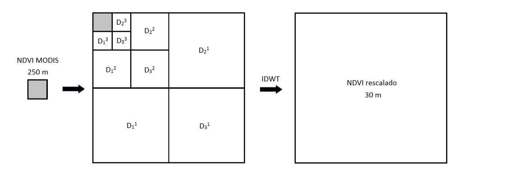
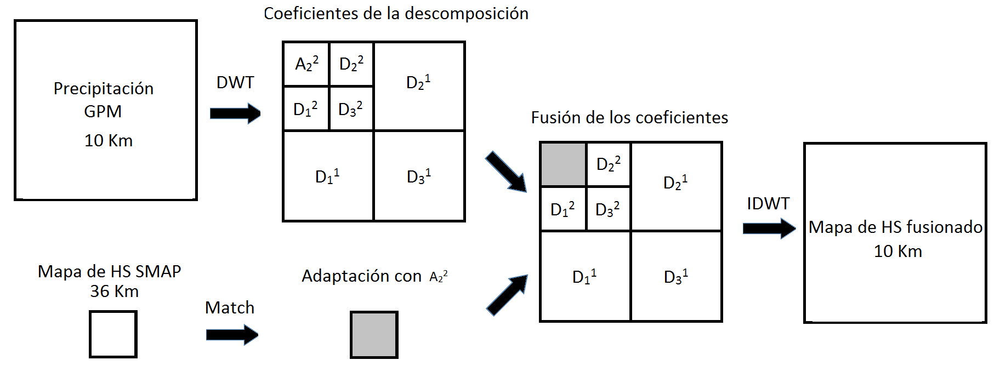
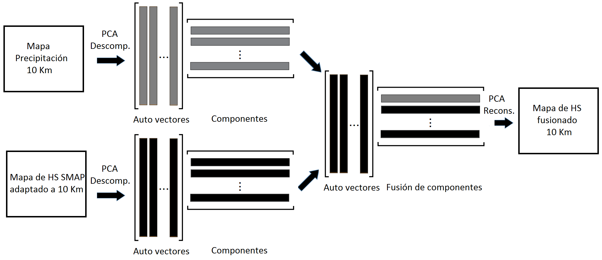

# Scaling

## Resample NDVI maps using wavelet transform

It is proposed to use the reconstruction of the signal from the original image and thus increase its spatial resolution. Reconstruction is performed using the inverse discrete wavelet transform (IDWT) in two dimensions. For which, it is taken as the initial approximation coefficient (A_{ij}) the MODIS image with 250 m spatial resolution, and the IDWT is applied three times. The detail coefficients are assumed the same size as the approximation image but equal to zero. The proposed scheme is shown in the following figure:

  

Satellite Data:

  - TERRA-MODIS product that provides NDVI data at a spatial resolution of 250 m every sixteen days (MOD13Q1)
  - Landsat 8

Different wavelet families have been tested: 'Haar', 'Daubechies', 'Coiflets' and 'Symlets', with different orders to make the resolution change. More details: https://pywavelets.readthedocs.io/en/latest/ref/wavelets.html

Finally, the NDVI MODIS images rescaled at 30 m were contrasted with Landsat 8 images to check the performance of each configuration.

## Downscaling SMAP soil moisture images with wavelets transform and PCA method

An algorithm to perform the rescaling of the satellite images is presented. The techniques used are: wavelet transforms (WT) and principal component analysis (PCA).

* Fusion using WT, the image with greater detail is first decomposed, the approximation coefficients are replaced by the adaptation of the less detailed image and finally the reconstruction process is applied. The adaptation of the minor detail image is done by resampling using the nearest neighbor method. The scheme used is presented in the following image:

  

* Fusion using PCA, the adaptation of the low resolution image to the hi resolution image is performed, that is, pixels size is modified by an interpolation method; in this case, the nearest neighbor method was used. Then the decompositions of both images are combined, exchanging the first coefficient of the image with fine spatial resolution for the first component of the image with coarse spatial resolution, as detailed in the scheme presented in the following image. Finally, the image reconstruction is performed.

  

Satellite Data:

  - SMAP L3 Soil Moisture Passive (SMAP_L3_SM_P)
  - Global Precipitation Measurement (GPM). Product: Integrated Multi-satellitE Retrievals for GPM (IMERG)

More details: https://ieeexplore.ieee.org/document/7996007

Dependences:
    
    python - Gdal
    python - pywt
    python - sklearn
    python - scipy
    python - NumPy
    python - Matplolib

Pages sources:

  PyWavelets: https://pywavelets.readthedocs.io/en/latest/

  PCA decomposition: https://scikit-learn.org/stable/modules/generated/sklearn.decomposition.PCA.html

